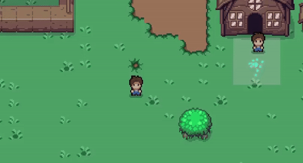
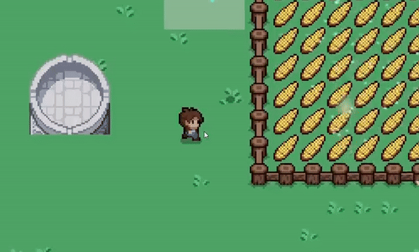

# **Jalveer Gatha** 🌊🌍  
**An Educational Journey in Groundwater Conservation**

Welcome to **Jalveer Gatha**, an educational game set in the fictional land of **Aquaterra**. As a Guardian of the Aquifer, or a **Jalveer**, it's your mission to restore balance to Aquaterra, a world suffering from environmental degradation due to unsustainable groundwater practices. Your journey spans five acts filled with challenges, critical decisions, and learning about water conservation. 🌱

---
# **What we did in the Internal Hackathon** 📚

## **Game Implementation Images** 🎮

### **Game Gif 1**

### **Game Gif 2**

### **Features**
- **Interactive Conversations**: The dialogue system enhances user experience by delivering contextual information, guiding players through tasks, and facilitating interactive decision-making within the game.

## **Chatbot Images** 🤖

### **Chatbot Interface**

### **Features**
- **Interactive Conversations**: The chatbot(NPC) provides real-time guidance, offering tips and educational information on groundwater management as players navigate challenges and make decisions in the game.
- **Integration**: The chatbot is seamlessly integrated into the application using an embedded interface, enabling users to interact with it directly within the game or website for real-time assistance and educational content.

## **MCQ System** ❓

### **MCQ System Overview**

## **Simulation System** 🖥️
- The simulation system immerses users in realistic scenarios, allowing them to experiment with different groundwater management strategies and observe the outcomes of their decisions in a dynamic environment.

## **Storyline** 🎮

### **Act 1: The Awakening**  
You begin as an ordinary resident of Aquaterra, unaware of the looming crisis. The environment shows signs of drought, water scarcity, and decay. One night, you're visited by the **Spirit of the Aquifer**, who reveals the dire situation. You are chosen to become a **Jalveer**, a protector of the land, to save Aquaterra from collapse. Your first task is to address water issues in your village by introducing sustainable practices like rainwater harvesting and microirrigation.

- **Objectives:**
  - Learn the basics of groundwater management and sustainable water use.
  - Implement simple water-saving measures in your village.

---

### **Act 2: The Challenge**
As you venture beyond your village, you find the surrounding regions in even worse condition. Rivers are drying up, forests are turning to dust, and the people are losing hope. It's up to you to bring new water conservation strategies to these communities.

- **Objectives:**
  - Introduce methods like artificial recharge and efficient irrigation systems.
  - Prevent groundwater contamination and implement local water management solutions.

---

### **Act 3: The Crisis**
Despite your best efforts, a severe drought hits Aquaterra. Overuse of groundwater by industries and mismanagement by local authorities push the land to the brink of collapse. Communities start to fight for the little water left, and you must make difficult decisions to ensure survival while maintaining long-term sustainability.

- **Objectives:**
  - Address groundwater depletion and manage emergency water supplies.
  - Make moral decisions about water distribution to ensure survival.

---

### **Act 4: The Restoration**
The crisis serves as a wake-up call for all of Aquaterra. With new technologies and ancient wisdom, the land begins to heal. As a Jalveer, you must unite the people and restore the balance, working closely with the **Spirit of the Aquifer** to bring lasting change.

- **Objectives:**
  - Implement large-scale water restoration projects, such as check dams and reforestation.
  - Collaborate with communities to balance agricultural, industrial, and domestic water use.

---

### **Act 5: The Future**
Thanks to your efforts, Aquaterra begins to flourish once more. The people have learned to value and protect their water sources, but the future remains uncertain, with threats like climate change and population growth on the horizon. Your final task is to ensure that Aquaterra's water management systems will endure for generations to come.

- **Objectives:**
  - Plan for long-term sustainability, teaching the importance of water governance and future risk management.
  - Promote innovative water conservation solutions to future-proof Aquaterra.

---

## **Epilogue**  
As the story concludes, you are honored as a **Jalveer**, and your efforts have set a new course for Aquaterra. The **Spirit of the Aquifer** tells you that your legacy will guide future generations in preserving their land and water for years to come.

---

